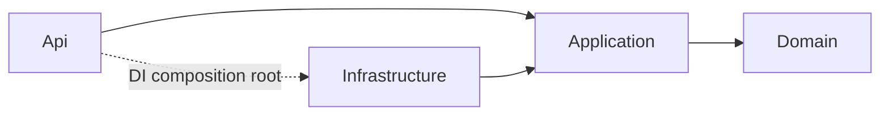
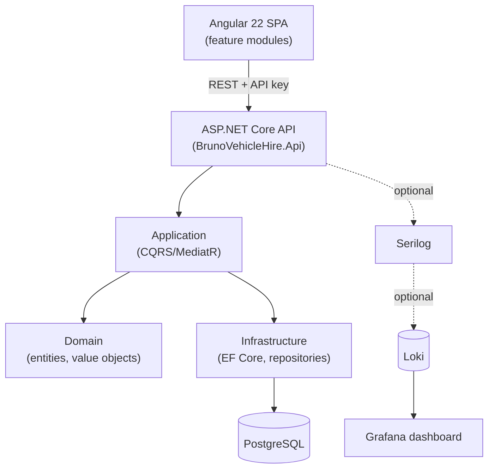
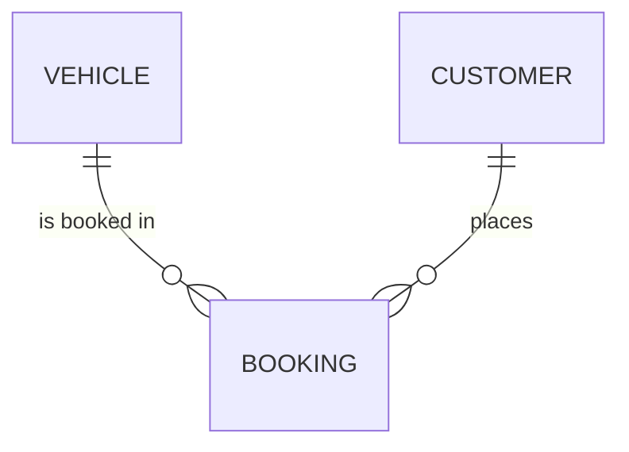

# Architecture Spine — Bruno Vehicle Hire

## Design Paradigm

**Backend — Clean Architecture (onion/layered, dependency inversion) + CQRS**, mandated by the brief:

| Layer | Namespace | Depends on |
|---|---|---|
| Domain | `BrunoVehicleHire.Domain` | nothing (zero outward dependencies) |
| Application | `BrunoVehicleHire.Application` | Domain only |
| Infrastructure | `BrunoVehicleHire.Infrastructure` | Application, Domain |
| Api | `BrunoVehicleHire.Api` | Application, Domain (Infrastructure wired only at the DI composition root) |

CQRS is realized via MediatR: every write is a `Command`, every read a `Query`, each with exactly one handler.

**Frontend — feature-based modular Angular app**, mirroring the backend's vertical slices: `vehicles`, `customers`, `bookings` feature modules. Each feature owns its **query/mutation logic and DTO-to-viewmodel mapping**, but every HTTP call routes through one shared `ApiClient` in `core/` that provides the base URL, error normalization, and the API-key interceptor hook — features never call `HttpClient` directly. This reconciles "feature-based structure" with stack.md's "Centralized API client" requirement: centralized *transport*, feature-owned *logic*. State follows AD-3.

## Invariants & Rules

### AD-1 — Dependency direction [ADOPTED]

- **Binds:** all layers
- **Prevents:** Infrastructure or Api leaking into Domain/Application; Domain reaching outward to EF Core, MediatR contracts aside, or any framework type
- **Rule:** Domain has zero project references. Application references only Domain. Infrastructure and Api reference Application + Domain. Api never calls Infrastructure types directly — only via interfaces resolved through DI. Enforced by an architecture fitness test (NetArchTest.Rules or ArchUnitNET) asserting no type in `Api.Controllers` references `Infrastructure.*`, run as part of the test suite (see AD-18) — the reference graph alone does not stop a developer from `new`-ing an Infrastructure type in a controller, since Api must reference Infrastructure's assembly to compose DI in `Program.cs`.



### AD-2 — CQRS via MediatR [ADOPTED]

- **Binds:** CAP-1 through CAP-6, CAP-11, CAP-12
- **Prevents:** direct service-to-service calls bypassing the command/query pipeline; inconsistent request handling; a frontend that can't tell whether a mutation response already carries the updated entity
- **Rule:** every write is an `IRequest` command, every read an `IRequest<TDto>` query, each with exactly one `IRequestHandler`. Every mutating Command handler that creates or updates an aggregate returns that aggregate's DTO — the same shape its sibling Query returns — never a bare id or `Unit`, except Cancel/SoftDelete/Anonymize/Delete commands, which return `Unit`/204. Use MediatR's free Community edition (eligible: solo, non-commercial, non-production-scale, well under the $5M revenue threshold) — register the free Community license key at startup (a required, no-cost, no-approval step) so the license check doesn't start logging warnings unexpectedly. Note in the README that a real company adopting this codebase would need to evaluate MediatR's commercial license (mandatory for production use at v13+) before shipping it.

### AD-3 — Angular state management

- **Binds:** CAP-8
- **Prevents:** feature modules diverging on state approach; a feature's local state silently desyncing from another feature's server-state cache; query-key collisions serving one feature's cached response to another
- **Rule:** native Angular Signals for local/UI state; TanStack Query's Angular adapter (`@tanstack/angular-query-experimental`) for server-state fetching, caching, and invalidation. All server-state writes (create/update/cancel/anonymize) go through TanStack Query mutations, invalidating the owning entity's query keys — never a hand-rolled Signal array standing in for cached server data. Query-key convention: `[entityName, 'list' | 'detail', ...params]`, `entityName` matching the feature folder name. No NgRx. Orthogonal to any future backend caching layer (e.g. Redis — see Deferred). **Caveat:** the Angular adapter still ships under the `-experimental` name and its own docs warn breaking changes can land even in patch releases — pin an exact version in `package.json` (no caret range), don't auto-upgrade without checking the changelog.

### AD-4 — Application layer organization

- **Binds:** CAP-7
- **Prevents:** a horizontal Commands-vs-Queries-first split that scatters one feature's logic across unrelated folders
- **Rule:** vertical slice per entity — `Application/Vehicles/{Commands,Queries,Dtos,Validators}`, `Application/Customers/...`, `Application/Bookings/...`. Never a horizontal `Commands/`, `Queries/` split at the top level.

### AD-5 — Repository shape

- **Binds:** CAP-7
- **Prevents:** a generic `IRepository<T>` erasing aggregate-boundary thinking; repositories silently auto-committing mid-handler and breaking cross-aggregate transactional atomicity
- **Rule:** one specific repository interface per aggregate root — `IVehicleRepository`, `ICustomerRepository`, `IBookingRepository` — each with intention-revealing methods (e.g. `GetActiveBookingsForVehicleAsync`, not a generic `Query`). Repository methods never call `SaveChangesAsync` themselves. A single `IUnitOfWork.SaveChangesAsync()`, invoked exactly once per handler, is the only thing that commits.

### AD-6 — Primary key strategy

- **Binds:** Vehicle, Customer, Booking ids
- **Prevents:** random-Guid B-tree index fragmentation under insert load; a handler returning `Guid.Empty` because the id wasn't assigned until an EF Core value generator ran at insert time
- **Rule:** all ids generated via `Guid.CreateVersion7()` (time-ordered UUIDs, native since .NET 9+), assigned by the entity's constructor/factory at construction time — never by an EF Core value generator or DB default. The entity is valid and identified immediately, before `SaveChangesAsync`.

### AD-7 — Booking overlap check placement

- **Binds:** CAP-3
- **Prevents:** DB-querying logic leaking into Domain; the overlap rule scattering across handlers untested; the exact off-by-one bug boundary semantics create; a check-then-insert race between two concurrent requests
- **Rule:** two layers, both required:
  1. **Application-level:** `CreateBookingCommandHandler` loads existing active bookings for the vehicle via `IBookingRepository` (a data concern), then calls the pure domain method `DateRange.Overlaps(other)` to decide (the rule itself). `DateRange` is a Value Object with zero infrastructure dependencies, fully unit-testable. Overlap is defined on a half-open interval: `StartA < EndB && StartB < EndA` — `EndDate` is the checkout day, exclusive, so same-day turnover (one booking's `EndDate` equals another's `StartDate`) is not an overlap.
  2. **Database-level backstop:** a Postgres `EXCLUDE USING GIST` constraint on `Booking` — `(vehicle_id WITH =, daterange(start_date, end_date, '[)') WITH &&) WHERE (status != 'Cancelled')`, requiring the `btree_gist` extension — closes the race window the application check alone can't (two concurrent requests both reading "no conflict" before either inserts).

### AD-8 — API error contract

- **Binds:** CAP-5, CAP-7
- **Prevents:** inconsistent error shapes the Angular error interceptor can't key off; the same class of rule (state-dependent rejection) landing on different status codes depending on which developer implemented it
- **Rule:** RFC 9457 ProblemDetails (the current standard; obsoletes the commonly-cited RFC 7807, same shape/behavior) via ASP.NET Core's built-in `AddProblemDetails()` + `IExceptionHandler`. The general test, not an enumerated list: FluentValidation validates only the shape/presence of input fields in isolation → `400 Bad Request`. Anything that requires loading persisted state or calling an entity method to evaluate (overlap, cancel guards, EndDate<=StartDate, duplicate `RegistrationNumber`/`Email` checked via a pre-insert existence query, **and booking a soft-deleted vehicle** — AD-13's query filter alone would otherwise surface this as a generic 404, contradicting CAP-5's "specific, actionable inline error" requirement, so the handler checks `Vehicle.IsDeleted` explicitly and throws the same `DomainRuleViolationException` path) → `409 Conflict`. Every `type` URI follows one template — `urn:bruno:{entity}:{rule-kebab-case}` — generated from a single const list, never hand-typed per handler. The exception handler never interpolates raw PII (Customer.Email/PhoneNumber) into a `ProblemDetails.detail` string — error messages reference the customer by id, never by the PII field that triggered the rule.

### AD-9 — Booking date type

- **Binds:** CAP-3
- **Prevents:** time-of-day/timezone ambiguity causing off-by-one overlap bugs
- **Rule:** `Booking.StartDate` / `EndDate` are `DateOnly`, mapped to a Postgres `date` column. Boundary semantics for what counts as overlap live in AD-7.

### AD-10 — Validation execution

- **Binds:** CAP-7
- **Prevents:** validation skipped or duplicated per-handler; reliance on the deprecated `FluentValidation.AspNetCore` package; an unbounded `pageSize` silently reaching the repository because a feature "forgot" to add a validator
- **Rule:** FluentValidation validators run inside a MediatR pipeline behavior (`ValidationBehavior<TRequest,TResponse>`) ahead of every handler, never invoked manually. Every Query taking pagination/filter parameters has a corresponding validator bounding `page`/`pageSize` — not optional per-feature.

### AD-11 — API key authentication

- **Binds:** CAP-6
- **Prevents:** raw middleware that bypasses `[Authorize]` and leaves Swagger's security definition inconsistent with actual enforcement; an opt-in `[Authorize]` controller that's one forgotten attribute away from shipping unauthenticated
- **Rule:** implemented as a custom `AuthenticationHandler` registered via `AddAuthentication().AddScheme<...>()`, integrating with `[Authorize]` and the Swagger security definition. Enforced via a global `FallbackPolicy` requiring the API-key scheme by default (secure-by-default) — `[AllowAnonymous]` is the only opt-out, used nowhere in v1. Wire contract: the key travels in an `X-Api-Key` request header.

### AD-12 — PII field encryption

- **Binds:** CAP-6, CAP-11, CAP-12
- **Prevents:** hand-rolled AES with manual key/IV handling; PII becoming permanently unreadable after a container restart; seed data silently landing as plaintext
- **Rule:** `Customer.Email` and `Customer.PhoneNumber` are encrypted via an EF Core value converter — satisfying the spec's "EF Core value converter (AES)" requirement — backed internally by ASP.NET Core's Data Protection API (`IDataProtector`), which itself performs AES-based encryption under a framework-managed key ring, rather than a hand-rolled `System.Security.Cryptography.Aes` call with manually-handled keys/IVs. Same requirement (EF Core value converter, AES), safer key/IV handling. Data Protection keys are persisted via `PersistKeysToFileSystem` to a docker-compose-mounted volume — never left on the ephemeral in-container default — so encrypted PII survives a `docker-compose down`/`up` cycle, which the spec's success signal depends on. Never logged in plaintext (console, file, or Loki sinks alike). Seed data is inserted through the same EF Core `SaveChanges` path as application writes (never raw SQL/bulk-copy), so the value converter always applies.

### AD-13 — Customer soft-delete vs. anonymize

- **Binds:** CAP-2, CAP-11, CAP-12
- **Prevents:** conflating a reversible hide with an irreversible erasure; an anonymized customer remaining selectable for a brand-new booking
- **Rule:** Vehicle and Customer both use an EF Core global query filter on `IsDeleted` to exclude soft-deleted rows from default listings and new bookings — soft-delete never touches PII, fully restorable. `IsAnonymized` participates in that same exclusion filter: an anonymized customer is excluded from default listings and cannot be selected for a new booking, remaining only as a referential-integrity anchor for their historical bookings. Anonymize is a distinct command calling `Customer.Anonymize()`, which scrubs name/email/phone and sets `IsAnonymized`; no un-anonymize method exists, by construction. Hard delete remains available only when the customer has zero bookings. **Filter carve-out:** EF Core global query filters propagate to `Include()`/navigation traversal by default — a Booking→Customer join would silently drop a soft-deleted or anonymized customer, breaking CAP-12's "booking history remains queryable" success criterion. Booking-history and booking-detail queries that need the associated customer explicitly call `.IgnoreQueryFilters()` on that join so the (possibly anonymized) customer record still resolves.

### AD-14 — Paginated list response & request shape

- **Binds:** CAP-4
- **Prevents:** each feature inventing its own pagination envelope or query-string contract, breaking a generic Angular list/query hook
- **Rule:** every paginated list endpoint (Vehicles, Customers, Bookings) returns the same `PagedResult<T>` DTO shape: `{ items: T[], totalCount: number, page: number, pageSize: number }`. Request side: `page` (1-indexed), `pageSize`, and an entity-specific `search` query-string parameter, consistently named across all three list endpoints.

### AD-15 — Aggregate construction and mutation

- **Binds:** all Application handlers, Domain entities
- **Prevents:** business rules leaking out of entities into handlers, undermining the "rich domain model" requirement; one entity exposing public settable properties while a sibling entity doesn't, drifting on construction style
- **Rule:** aggregates are constructed only via a static factory method or non-default constructor performing invariant checks (`Vehicle.Create(...)`, `Booking.Create(...)`) — no entity exposes a public settable (`set` or `init`) property; persistence-only mutation happens through EF Core's backing-field/private-setter materialization, never a public accessor. Post-construction state changes happen only through methods on the aggregate root (e.g. `Booking.Cancel()`, `Customer.Anonymize()`, `Vehicle.SoftDelete()`).

### AD-16 — Booking cancel vs. delete semantics

- **Binds:** CAP-3
- **Prevents:** a physical row delete destroying the audit trail the `Status` enum and the Customer soft-delete/anonymize precedent both point toward keeping
- **Rule:** the brief's "delete" requirement for bookings is implemented as **cancel**, never a physical row delete: `Booking.Cancel()` transitions `Status: Active → Cancelled`. "Cannot delete past bookings, can only delete future ones" is realized as "can only cancel future, Active bookings." No booking row is ever physically removed via the API.

### AD-17 — Booking Completed transition

- **Binds:** CAP-3, CAP-4
- **Prevents:** `Status` reinterpreting domain-model.md's three literal stored values (Active/Completed/Cancelled) as only two ever actually persisted; a Query handler performing a write to "helpfully" update stale status, breaking CQRS purity (AD-2)
- **Rule:** a `BookingCompletionSweepService : BackgroundService` (built into ASP.NET Core, no external scheduler/infra) runs on a timer (e.g. every 15 minutes, configurable), queries `Active` bookings with `EndDate` in the past, and dispatches a `CompleteBookingCommand` through MediatR per booking — a normal Command through the normal pipeline, mutating via `Booking.Complete()` (AD-15). `Status` is genuinely persisted as all three literal values, matching domain-model.md. No Query handler ever writes.

### AD-18 — Testing strategy

- **Binds:** CAP-9, AD-1 (fitness test)
- **Prevents:** CAP-9's graded test minimum being met with tests that don't actually exercise the architecture; relational constraints (unique, FK, the AD-7 EXCLUDE constraint) going unverified because EF Core InMemory doesn't enforce them
- **Rule:** the whole system (backend and frontend) is built test-first (red-green-refactor) — CAP-9's stated floor of 2 command tests, 2 query tests, and 1 business-rule test is the documented minimum a TDD-built codebase clears many times over, not a target written toward after the fact. xUnit as the test framework. NSubstitute for mocking repository interfaces in Application-layer handler tests. FluentAssertions for readable assertions. `Testcontainers.PostgreSql` (4.12.0) spins up a real Postgres instance for integration tests — the only way to verify unique constraints, FK enforcement, and the AD-7 exclusion constraint actually work, since EF Core's InMemory provider doesn't enforce relational constraints. One xUnit test project per layer that needs independent testing (`Domain.Tests`, `Application.Tests`, `Integration.Tests`) per the Structural Seed tree. The AD-1 dependency-direction fitness test (NetArchTest.Rules or ArchUnitNET) lives in one of these projects and runs as part of the same `dotnet test` pass. Code coverage is made visible, not just tracked internally: `coverlet.collector` (10.0.1) via `dotnet test --collect:"XPlat Code Coverage"`, rendered as a browsable HTML report via `ReportGenerator`, on the backend; Angular CLI's built-in `ng test --code-coverage` (Istanbul-based HTML report) on the frontend. Both are local visibility tools referenced from the README, not a CI gate — no CI pipeline exists per the spec's non-goals.

## Consistency Conventions

| Concern | Convention |
|---|---|
| Naming (entities, files, interfaces, events) | C# types/namespaces PascalCase (`BrunoVehicleHire.Domain`); MediatR requests suffixed `Command`/`Query` (`CreateVehicleCommand`, `GetVehicleByIdQuery`); Angular files kebab-case per Angular style guide |
| Data & formats (ids, dates, error shapes, envelopes) | Ids: Guid v7 (AD-6). Calendar dates: `DateOnly` (AD-9); timestamps (`CreatedDate`): UTC `DateTime`. Errors: ProblemDetails (AD-8). Paginated lists: `PagedResult<T>` (AD-14). JSON payloads: camelCase (ASP.NET Core `System.Text.Json` default), uniformly, no per-controller override. Enums serialize as strings, never ints (`Booking.Status` → `"Active"`/`"Completed"`/`"Cancelled"`) |
| Routes | Plural nouns (`/api/vehicles`, `/api/bookings`); non-CRUD domain actions as sub-resource verbs (`POST /api/bookings/{id}/cancel`), never a query-string action parameter |
| State & cross-cutting (mutation, errors, logging, config, auth) | Construction/mutation only via aggregate root factory/methods (AD-15). Errors via ProblemDetails (AD-8). Logging: Serilog, structured, PII redacted, optionally shipped to Loki (CAP-13). Config: `IOptions<T>` + environment variables/user-secrets, never hardcoded. Auth: API key via custom `AuthenticationHandler`, secure-by-default fallback policy (AD-11) |
| Transport security | HTTPS enforced via `UseHttpsRedirection()` + local dev cert (`dotnet dev-certs https`); Angular dev server proxies to the HTTPS API origin |
| CORS | Named policy allowing only the Angular dev server origin (`localhost:4200`), dev-only |
| Migrations & seed data | `Database.Migrate()` runs on API startup (one `docker-compose up` + `dotnet run` reaches a current schema); a dedicated `ISeeder` runs once after migration, generating synthetic PII via Bogus, inserted through EF Core `SaveChanges` (never raw SQL) so AD-12's value converter applies |
| Frontend model separation | `core/models` holds API DTOs; `features/{x}/models` holds view models; an explicit mapper function per feature converts DTO → ViewModel — the frontend analogue of AD-4's backend discipline |

## Stack

| Name | Version |
|---|---|
| .NET | 10 (LTS) |
| Angular | 22 (stable; requires TypeScript 6) |
| EF Core | 10 |
| Npgsql.EntityFrameworkCore.PostgreSQL | 10.0.3 |
| PostgreSQL | 17+ (18 recommended); `btree_gist` extension enabled (AD-7) |
| MediatR | 14.2.0, Community edition (free license key self-registered at startup) |
| FluentValidation | 12.1.1 |
| TanStack Query (Angular adapter) | `@tanstack/angular-query-experimental` — pin exact version, still experimental |
| xUnit + NSubstitute + FluentAssertions | current at build time — unit tests |
| Testcontainers.PostgreSql | 4.12.0 — Postgres-backed integration tests (real constraints, not EF Core InMemory) |
| coverlet.collector + ReportGenerator | 10.0.1 + current — backend code coverage, browsable HTML report |
| Angular CLI `ng test --code-coverage` | built-in — frontend code coverage, Istanbul HTML report |
| Serilog + Serilog.Sinks.Grafana.Loki | current per NuGet at build time (CAP-13, optional) |
| Grafana + Loki | current stable container images (CAP-13, optional) |
| Docker Compose | local Postgres (+ optional Loki/Grafana), Data Protection key volume |

## Structural Seed





```text
src/
  BrunoVehicleHire.Domain/
    Vehicles/          # Vehicle entity
    Customers/          # Customer entity, anonymize/soft-delete methods
    Bookings/            # Booking entity, DateRange value object
  BrunoVehicleHire.Application/
    Vehicles/{Commands,Queries,Dtos,Validators}/
    Customers/{Commands,Queries,Dtos,Validators}/
    Bookings/{Commands,Queries,Dtos,Validators}/
    Common/              # PagedResult<T>, ValidationBehavior
  BrunoVehicleHire.Infrastructure/
    Persistence/         # DbContext, EF configurations, migrations
    Repositories/
    Security/             # Data Protection-backed value converter
    BackgroundServices/   # BookingCompletionSweepService (AD-17)
  BrunoVehicleHire.Api/
    Controllers/
    Auth/                 # API key AuthenticationHandler
    ExceptionHandling/

tests/
  BrunoVehicleHire.Domain.Tests/       # DateRange, aggregate invariants - pure unit tests
  BrunoVehicleHire.Application.Tests/  # command/query handler tests (NSubstitute for repos)
  BrunoVehicleHire.Integration.Tests/  # Testcontainers.PostgreSql - real constraints, migrations, EXCLUDE constraint

frontend/src/app/
  core/
    models/               # API DTOs
    api-client/            # shared HTTP client, error normalization, API-key interceptor
  shared/
  features/
    vehicles/{models,components,...}/
    customers/{models,components,...}/
    bookings/{models,components,...}/
```

## Capability → Architecture Map

| Capability | Lives in | Governed by |
|---|---|---|
| CAP-1 Vehicle management | Domain.Vehicles, Application.Vehicles, Api | AD-1, AD-4, AD-5, AD-6, AD-13, AD-15 |
| CAP-2 Customer management | Domain.Customers, Application.Customers, Api | AD-1, AD-4, AD-5, AD-6, AD-13, AD-15 |
| CAP-3 Booking management | Domain.Bookings, Application.Bookings, Api | AD-1, AD-4, AD-5, AD-6, AD-7, AD-9, AD-13, AD-15, AD-16, AD-17 |
| CAP-4 Search & filtering | Application (Queries), Api | AD-10, AD-14, AD-17 |
| CAP-5 Business-rule feedback UX | Api (ProblemDetails), Angular error interceptor | AD-8 |
| CAP-6 Secure API access | Api.Auth | AD-11, AD-12 |
| CAP-7 Backend architecture demonstration | whole backend | AD-1 through AD-6, AD-10, AD-15, AD-18 |
| CAP-8 Frontend architecture demonstration | frontend/src/app | AD-3, Design Paradigm, frontend model-separation convention |
| CAP-9 Automated test coverage | tests/ (see Structural Seed) | AD-18 |
| CAP-10 Submission quality | README, seed data, repo root | Migrations & seed data convention |
| CAP-11 Soft-delete/restore customer | Domain.Customers, Infrastructure (query filter) | AD-13 |
| CAP-12 Anonymize customer | Domain.Customers, Infrastructure.Security | AD-12, AD-13 |
| CAP-13 Observable logging (optional) | Api, docker-compose | Stack table |

## Deferred

- **Domain Events** — optional/bonus per spec. If pursued: an `AggregateRoot` base class holds a `_domainEvents` list, dispatched via an EF Core `SaveChanges` interceptor as MediatR `INotification`s. Decided fully only if the timeframe allows building it.
- **Redis / distributed caching** — not required at single-instance scale, not in the brief. Orthogonal to AD-3 (frontend state); would sit behind the repository layer if ever added.
- **Deployment & environments / CI-CD / infra-provider strategy** — explicitly out of scope per SPEC.md non-goals. Local-only via `docker-compose` (Postgres with `btree_gist`; Data Protection key volume; optionally Loki+Grafana per CAP-13). No environment promotion, no cloud provider decision needed.
- **Rate limiting / throttling** — not required by the brief; worth a README "future work" mention alongside CAP-13's observability note, not built.
- **Un-anonymize / PII recovery window** — out of scope; anonymize is irreversible by design (AD-13). A time-boxed "undo" grace period was considered and rejected because it would reintroduce recoverable PII, defeating the erasure guarantee.
